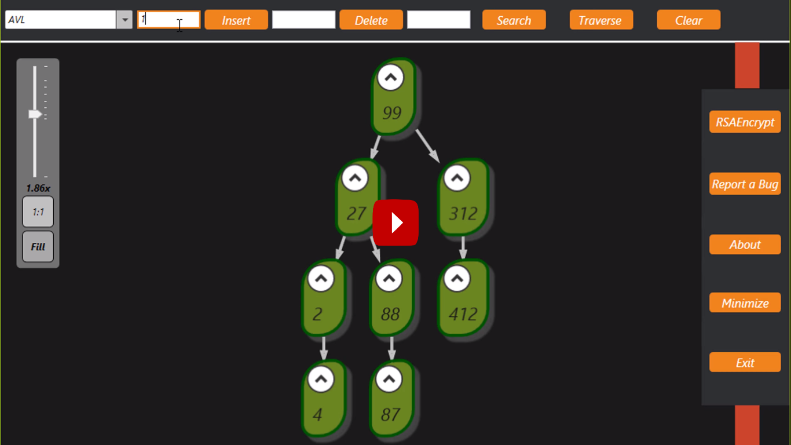

# Data-Structure-and-Algorithms-Visualization-
Show Me is a desktop application which simulate 7 different data structures ( Linked List - Stack - Queue - Binary Tree - Binary Search Tree - AVL - Graph ) and has made to help students better understand data structures and algorithms, by allowing them to learn the basics on their own and at their own pace.
show me has encrypt/decrypt system also, using RSA algorithm.

<h1>Requirements</h1>
Telerik  
GraphSharp
